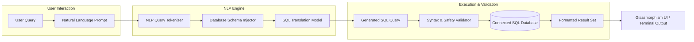

# 🍌 Banana Shell | NL to SQL

       <a href="https://bananashell.vercel.app">
</a>

**Banana Shell** is a futuristic, intelligent command-line shell designed to combine stunning visuals with powerful functionality.

### ✨ Features

- 💎 **Glasmorphism UI** – A sleek, modern interface with frosted-glass effects.
- 🌈 **Colorful Yet Clean** – Carefully chosen colors for clarity and style.
- 🧠 **Smart Capabilities** – Built-in **NLP to SQL** conversion for effortless querying.
- 🍌 **Banana Prompts** – Unique, intuitive prompts to enhance user experience.
- 🚀 **User-Friendly** – Designed for both developers and power users.

> 🍌 *Banana Shell: Where intelligence meets aesthetics in your terminal.*

---

## Architecture Pipeline



## Installation & Setup

### Prerequisites
- Python 3.8+
- Active SQL Database (MySQL, PostgreSQL, or SQLite)

### 1. Clone & Navigate
```bash
git clone https://github.com/tjiuce/nlp-to-sql.git
cd nlp-to-sql
```

### 2. Install Dependencies
```bash
pip install -r documentation/installation/requirements.txt
```

### 3. Configure Database Connection
Edit `app/src/db_config.py` with your database credentials:
```python
DB_HOST = "localhost"
DB_USER = "your_username"
DB_PASSWORD = "your_password"
DB_NAME = "your_database"
```

### 4. Launch Application
```bash
python app/src/main.py
```

## Sample Usage

| Natural Language Input | Generated SQL Query |
|---|---|
| *"Show all customers from New York"* | `SELECT * FROM customers WHERE city = 'New York';` |
| *"Find total sales by product category in 2024"* | `SELECT category, SUM(amount) FROM sales WHERE year = 2024 GROUP BY category;` |
| *"List top 5 highest order totals"* | `SELECT * FROM orders ORDER BY total_amount DESC LIMIT 5;` |

---

| Initial Screen |
|-|
|  |

<details>
<summary>View More</summary>
  
| Database Connected |
|-|
|  |

| Connection Failure |
|-|
|  |

</details>